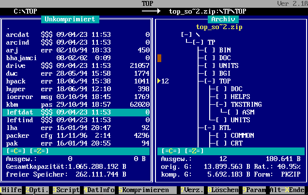

# TOP-16Bit-Compression-UI

This MS-DOS based user interface (UI) for compression programs is a project from the early 90s, designed to provide a graphical front-end for various pre-Windows compression programs. It is hosted on GitHub for programmers interested in exploring the source code, development environment, and usage.

## Table of Contents
- [UI Features](#ui-features)
- [Development Environment](#development-environment)
- [Usage](#usage)
- [Packaging Programs](#packaging-programs)
- [GitHub Repository Content](#github-repository-content)

## UI Features

- **Norton Commander-style UI**: Dual-pane layout with a directory tree on the left and file listing on the right.
- **Compatibility**: Works with 12 different compression programs.
- **Editing capabilities**: Allows editing contents of compressed files.
- **Adaptable command-line parameters**: Customize command-line arguments for each compression program.

## Development Environment

- **Turbo Pascal**: The program is written in Turbo Pascal, which later evolved into Borland Pascal.
- **Source code and environment backup**: The source code and a functioning Turbo Pascal 7.0 environment (licensed in 1992) will be included in the release.
- **German language UI**: The UI is written in German but is designed to be intuitive and easy to use.

## Usage

1. Launch `TOP.EXE` in DOSBox or a compatible environment.
2. Navigate the directory tree in the left window to select files for compression.
3. Select one or more files using the mouse or key-space for multiple selections.
4. Press F5 or click "Compress" in the lower menu to start the compression process.
5. In the right window, click on an archived file to navigate and edit its contents.
6. Press F2 or click "Config" in the lower menu to configure paths for the compression programs, and add the absolute path to the PACKER directory.
7. For more detailed instructions, refer to the `TOP.txt` file (in German).

## Packaging Programs

The following compression programs are supported by the UI and will be included in the release:

1. ARC - Version 6.02 (Jan 1989)
2. ARJ - Version 2.41ge.a (Jul 10 1993)
3. BSA - Version 2.00 (1992-1994)
4. DWC - Version A5.01 (May 31 1988)
5. HPACK (Jun 18 1994)
6. HYPER - Version 2.6 (May 18 1992)
7. LHA - Version 2.13 (1991)
8. LIMIT - Version 1.0 (July 1993)
9. PAK - Version 2.51 (Oct 8 1990)
10. PKUNZIP - Version ? (Feb 1 1993)
11. PKZIP - Version 2.04g (Feb 2 1993)
12. SQZ - Version ? (Jan 24 1993)
13. ZOO - Version 2.1 (Jul 9 1991)

## GitHub Repository Content

The repository contains the source code, along with the Turbo Pascal 7.0 development environment, the runnable program, and a collection of early 90s compression programs used by the UI. However, some components like the Archive and TFunktion Units are missing, which results in the `ARCVIEW.INC` file being present in the repository but not embedded in the code due to these missing units. Despite these limitations, this GitHub repository offers a valuable resource for programmers interested in early compression programs, user interfaces, and the Turbo Pascal development environment. 

The Release available for download separately includes the complete Turbo Pascal environment, the `TOP.EXE` executable, and the source code with the listed components. Make sure to download the Release to access all the components and explore the full potential of the project.

